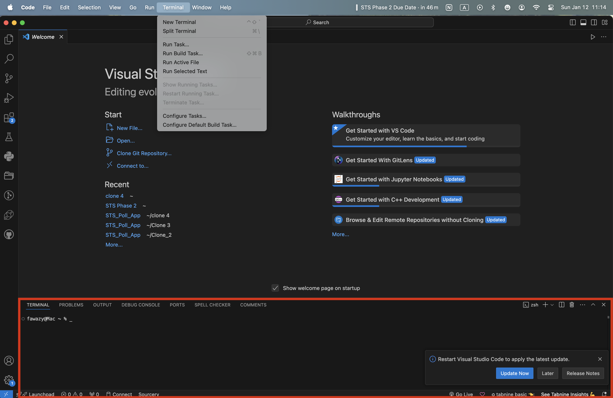
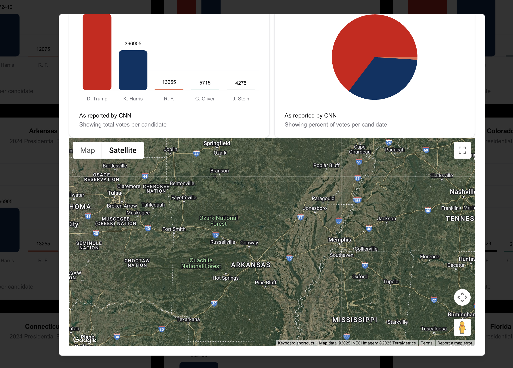
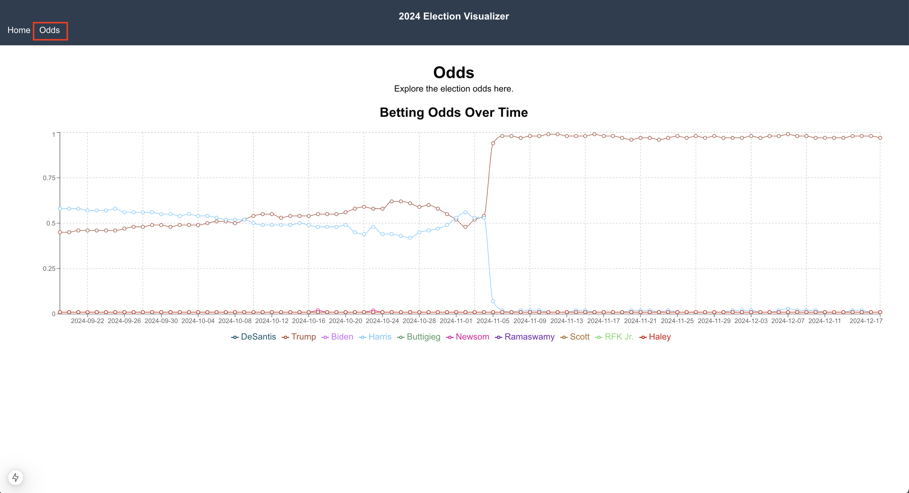

# Full Stack Take-Home Assignment

This project is a full-stack application for visualizing polling data, betting odds, and geographic information using Google Maps.

---

## Features

- **Polling Data Visualization**: Interactive bar charts for state-wide polling data.
- **Betting Odds Trends**: Multi-line charts to analyze betting odds over time.
- **Interactive Google Maps**: Searchable and responsive maps for visualizing state locations and their polling data.

---

## Prerequisites

### **Software/Tools Required**

#### **1. Node.js and npm**

- **Description**: Node.js is a JavaScript runtime for building scalable network applications, and npm is its default package manager.
- [Download Node.js](https://nodejs.org/en/download)
- [Node.js Installation Docs](https://nodejs.org/en/docs/guides/getting-started-guide)

---

#### **2. Python 3.12 and pip**

- **Description**: Python is a high-level programming language, and pip is its package installer.
- [Download Python 3.12](https://www.python.org/downloads/)
- [Python Installation Docs](https://docs.python.org/3/using/index.html)

---

#### **3. Django Framework**

- **Description**: Django is a high-level Python web framework for building web applications quickly and cleanly.
- [Django Installation Guide](https://docs.djangoproject.com/en/stable/intro/install/)

---

#### **4. React.js via Next.js**

- **Description**: React.js is a JavaScript library for building user interfaces. Next.js is a React framework for building full-stack applications.
- [Get Started with Next.js](https://nextjs.org/docs/getting-started)
- [Next.js Documentation](https://nextjs.org/docs)

- Google Maps API Key

### Libraries and Dependencies

- Front-End: `recharts`, `axios`, `tailwindcss`, `@shadcn/ui`
- Back-End: `django`, `django-rest-framework`, `pandas`

---

## Getting Started: Installation Instructions

- Once you have installed the necessary packages above, you may continue with the rest of the installation instructions.

### 1. Clone the Repository

```bash
https://github.com/FawazOmidiya/STS_Poll_App.git
```

- Copy this line, and select the option in your editor that says "Clone Git Repository". If you are using VS Code, it will look something like this:
  
- Once you click on it, it will prompt you to choose an EMPTY folder, and for the link directly above. Paste it in and the repository will be cloned successfully.

- First, open a terminal in your new project, this will show at the bottom of your code editor. Use the terminal to run the remaining commands in this tutorial.

- If you are struggling to open a terminal, select the option Terminal in your project menu, and select 'New Terminal'



---

### 2. Setup Environment

- Run this command to activate and run the setup all the technical requirements:

```bash
chmod +x setup.sh
./setup.sh
```

### 3. Now run this command to start ther development server!

```bash
chmod +x start.sh
./start.sh

```

If you want to end the server, enter control C in the command line

```bash
^C
```

# Walk Through of Use Cases

## 1 . Polling Data

- The polling data is available on the landing page, simply scroll through to view the different states and their information.

## 2. Google Maps

- To view the Google Maps visualization, simply click on any of the state bar graphs to open up the detailed view of that state, and roam around in the familiar Google Maps interface.
  

- Alternatively, you can search up a specific state using the select button as shown below to arrive at the same detailed view.
  
- In this view you can view an additional Pie Chart of the graph, and zoom in to your preferred location.

## 3. Betting Odds

- For this section, simply navigate over to the Odds title in the heading. The odds will be displayed, and you can easily navigate back and forth between the Home page and the Odds Page.
  
